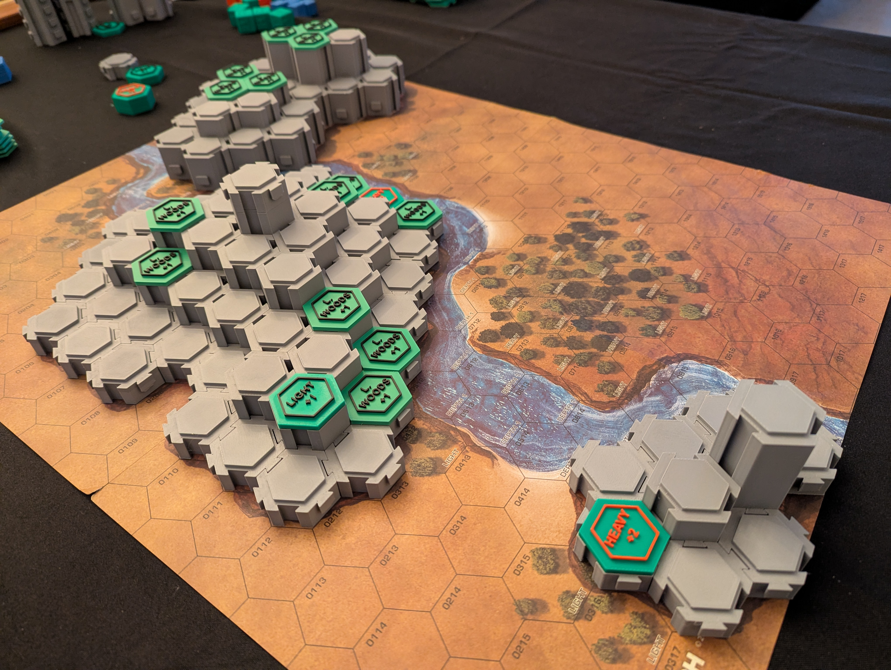
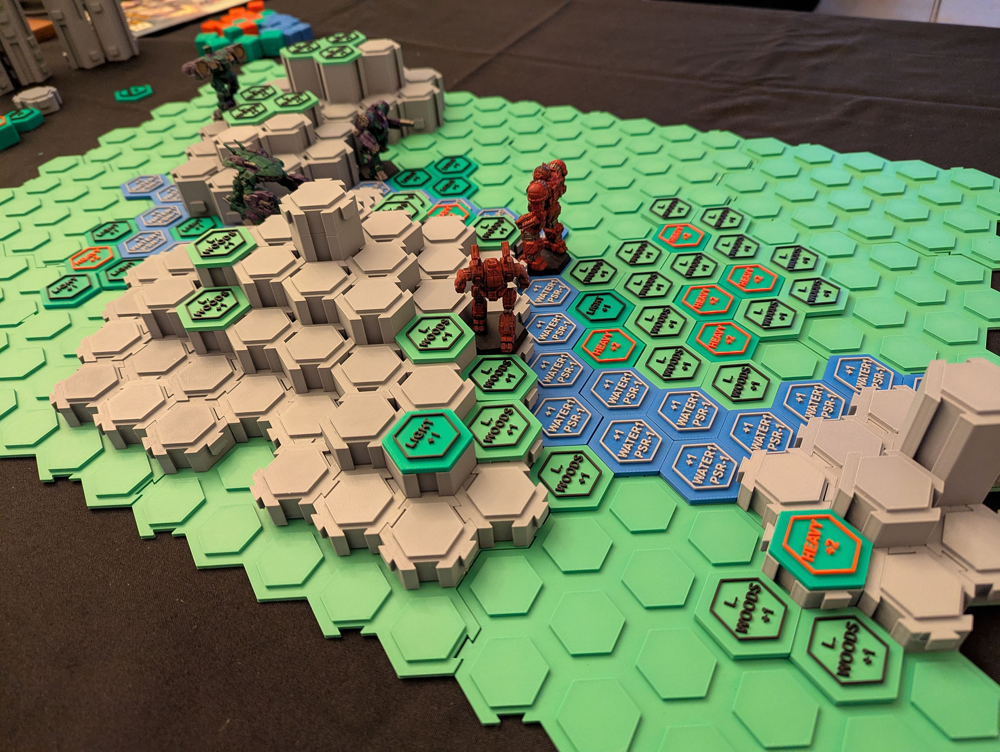
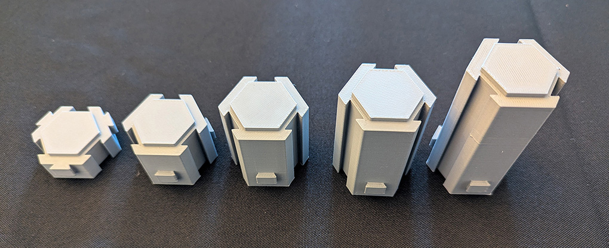
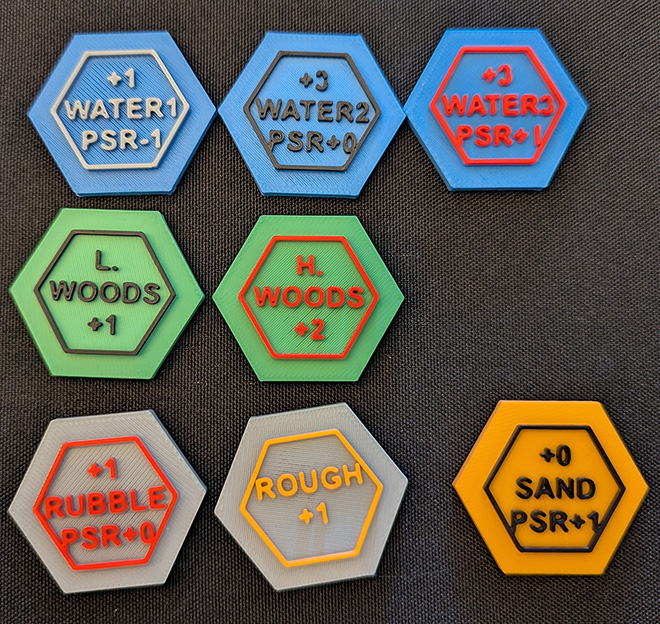
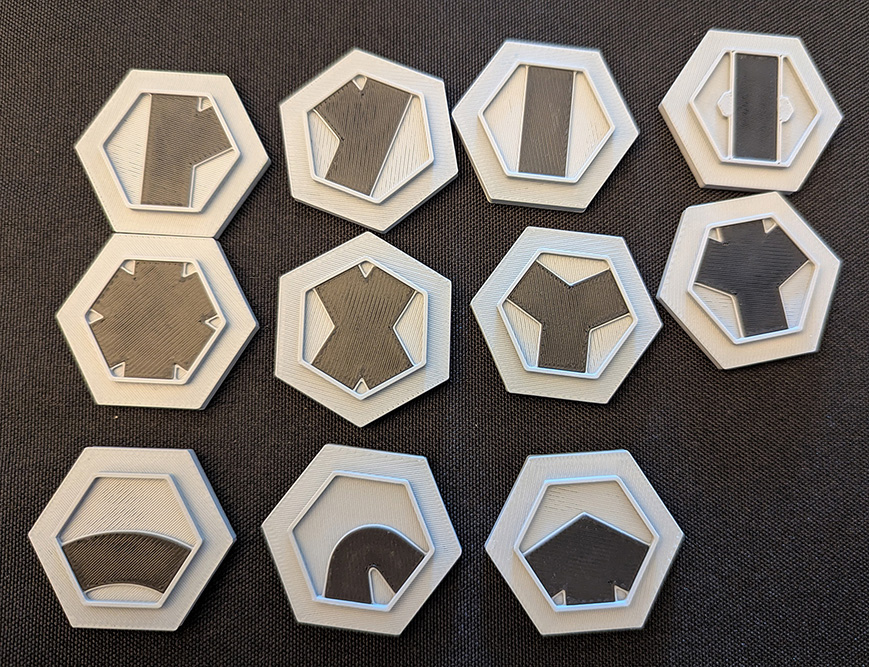
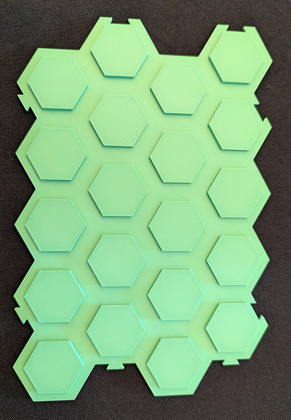

# OpenHexTiles

**A 3D-printable, open-source modular hexagonal terrain system for Battletech and other wargames.**

---

## About This Project

Welcome to **OpenHexTiles**! This is a complete modular terrain system designed to be 3D-printed with minimal fuss. It allows you to create dynamic, multi-level battlefields for tabletop games like Classic Battletech.

All pieces are designed to be compatible, whether you are building a full map from scratch or just adding elevation and features on top of an existing paper map.

This project is shared with the community. You are encouraged to fork, remix, and share your own creations based on this system!

## Key Components

This system is built from three main types of components:

* **Hex Risers:** These are the core building blocks for elevation. They are stackable "Level" blocks (L1, L2, etc.) that lock together horizontally with a **dovetail connection** and stack vertically with a universal "lip" system.

* **Terrain Inserts:** These are thin "toppers" or "caps" that fit perfectly into the top of any Hex Riser or Baseplate. They are used to mark special terrain types like forests, rough ground, water, and more.

* **Baseplates:** These are large, multi-hex (4x5) plates that act as the "Level 0" foundation. Use these if you want to build a complete, stable map from the ground up instead of using a paper map.

## Printing Notes & Tested Settings

These STL files are designed to be printed easily on most FDM printers, and should not require supports.

All components have been successfully tested using the following configuration as a baseline. Your settings may vary, but this is a confirmed working setup:

* **Printer:** Bambu Lab A1
* **Nozzle:** 0.4mm
* **Profile:** Standard 0.20mm Layer Height
* **Material:** Bambu Lab PLA Matte & PLA Basic
## License

This project is licensed under the **Creative Commons Attribution-NonCommercial-ShareAlike 4.0 International License (CC BY-NC-SA 4.0)**.

This means you are **free** to:
* **Share** — copy and redistribute the material.
* **Adapt** — remix, transform, and build upon the material.

Under the following terms:
* **Attribution (BY)** — You must give appropriate credit.
* **NonCommercial (NC)** — **You may not use this material for commercial purposes.** This includes (but is not limited to) selling the digital files or selling physical prints of these designs.
* **ShareAlike (SA)** — If you adapt this project, you must distribute your new creations under the same license.

You can read the full license summary here: [https://creativecommons.org/licenses/by-nc-sa/4.0/](https://creativecommons.org/licenses/by-nc-sa/4.0/)

## How to Contribute

Contributions are welcome and highly encouraged! This project is designed to be a community-driven system.

The best way to contribute is to `fork` this repository, make your changes, and then submit a `Pull Request`. I will review it and merge it into the main project.

### We Need Your Ideas!

Don't feel limited to just making new `Terrain Inserts` (though those are great!). The real goal is to expand this system with new functionalities. We would love to see contributions like:

* **New `Terrain Inserts`:** Especially those with 3D features (like small trees, rubble piles, or boulders) instead of just engraved text.
* **A `Road` or `River` System:** Design a set of tiles or toppers that can create continuous roads and rivers across the map. 
* **Modular `Buildings`:** A set of stackable or modular building components that fit the hex grid.
* **`Ramps` and `Slopes`:** New `Riser` designs that create smooth ramps between elevation levels (L0 to L1, L1 to L2).
* **New `Baseplates`:** Different sizes, adapter pieces, or edge/trim pieces to give your maps a clean finish.

If you have an idea, build it! We can't wait to see what you create.